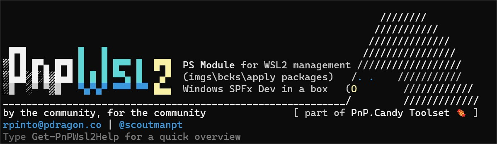
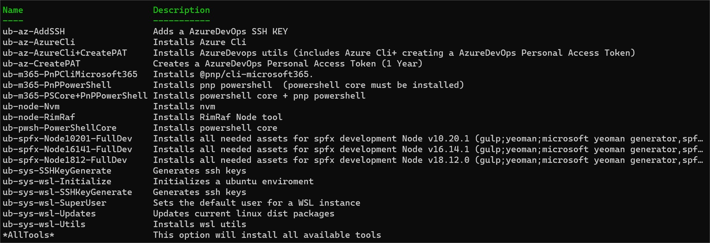

# PnP.Wsl2 PowerShell Module


This is a PowerShell module for managing WSL2.

## Why this module?  

I do love cmdline tools but most of them don't have autocompletion making us revisit command syntax help over and over again.

I've been diving deep into WSL2, and the journey led me to enhance the workflow significantly. 

I found myself yearning for a more streamlined approach to manage my WSL2 instances effortlessly – from backups and checkpoints to seamlessly injecting new bits into instances. Automation became the name of the game to make the whole process a delightful breeze

Setting up the development toolchain for the SharePoint Framework is documented, ... but it's still lot of work to do it manually.

And if you are a consultant in multiple clients, multiple tenants, multiple projects is daunting and ... it can be messy.

Plus i was actually tired of typing the same commands over and over again ( call me lazy 🤠)


  
 


### Main goals :
* Make it easy to manage WSL2 instances
* Automate WSL2 instances deploying and add extra features to them (like adding SharePoint Framework development environments, git configurations, powershell, python core and bits and other installations inside a linux distro). 

## Overview

Upon install this module will create a folder in your $HOME directory called PnPWsl2. 

This folder has 2 folders:

* instances - This folder contains all running WSL2 instances created by this module
* mods - This folder contains bash scripts to be executed upon your Wsl Instance ( form spfx dev tools to azurevops,sshkeys , Azure PAT,node,powershell,pnppowershel,etc )

With this module you will have the ability to :
  - Create a new Wsl instance with a specific name
  - Copy a Wsl instance to a new Instance
  - Export\Import a Wsl instance tar files (zip file)
  - Delete a Wsl instance
  - List all Wsl instances  
  - Create\Restore Wsl2 CheckPoints (its actually timestamped named tar files -oob wsl doesnt have checkpoints mechanisms)
  - Enable or Disable Wsl in your system
  - Add tools to a Wsl instance ( sh scripts that will install\execute in a wsl instance)

On each command you will have the ability to specify the Wsl instance\distribution  name just by hitting the tab key


Adding tools to a Wsl instance is just specifying the Wsl instance name and the tool name (tab key will help here too)


## Tools
I've added around 18 helper\tools ...  



... but you can have your own, just by  :  

* Creating a new sh script
* Add it to the mods folder
* Use the Add-WslTools command to add it to a Wsl instance

Cool hum? 🤠

## Installation

To install this module, run the following command in your PowerShell:

```powershell
Install-Module -Name PnP.Wsl2
```	
 Or just use the git clone command to clone this repo to your local machine and then import the module with the following command:
```powershell
Import-Module <PATH WHERE MODULE IS>PnP.Wsl2.psd1
```

## Usage
To use this module, first import it with the following command:
```powershell
Import-Module PnP.Wsl2
````
If you're using this module for the first time, you'll encounter this:

```powershell
PnPWsl2 assets are not present in the system

Input PnP.Wsl2 Rootfolder [default [C:\Users\<USERNAME>]]:
```	

This prompt enables you to designate the root folder for the module's assets, including instances and mods

  
    

<br>
I'm constantly adding new features and tools to this module, so if you have any suggestions, please let me know !  
<br>
<br>
Have fun, and feel free to contribute to this project !